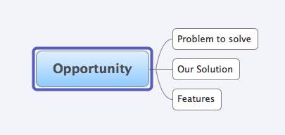

Cucumber-jvm tutorial Part 01
=============================

This is the first part of the cucumber-jvm tutorial. We start off with an empty Eclipse project. This project has the following folders:
* [requirements](requirements) - this is where you store requirements. 
* [src](src) - this is where you will put your source code. This folder is currently empty
* [test](test) - this is where you will put your test code.
* [lib](lib) - this is where you have jar files which your project depends on. At this moment, it is primarily cucumber-jvm-1.1.6 jar files, and the jar files which cucumber-jvm depends on.

### requirements
The requirements folder contains an opportunity.xmind file. 

  

This mind map comprises a skeleton requirements structure to motivate you to explore the problem you are solving, 
the kind of solution you are providing and your desired features.

### test
The test folder contains infrastructure code for you to run your first test, which at this moment there are none.
Here we only have skeleton glue code in terms of [suites](test/ngpanwei/bdd/suites) and [tests](test/ngpanwei/bdd/tests).

[FeatureTest.java](test/ngpanwei/bdd/tests/FeatureTest.java) contains the JUnit test class that links requirements (*.features) files to 
test step definitions that will be stored in [ngpanwei.bdd.stepdefs](test/ngpanwei/bdd/stepdefs)
````java
@RunWith(Cucumber.class)
@CucumberOptions(
		monochrome = true, 
		features = "requirements/features" ,
		glue = "ngpanwei.bdd.stepdefs" ,
		tags = { "~@Undefined"  } 
		)
public class FeatureTest {
}
````

[AllTest.java](test/ngpanwei/bdd/suites/AllTest.java) contains JUnit test suite that is useful for running multiple FeatureTests. 
In this case we only have one.
````java
@RunWith(Suite.class)
@SuiteClasses({ FeatureTest.class })
public class AllTest {
}
````

[TOP](https://github.com/ngpanwei/cucumber-jvm-tutorial/blob/master/README.md)
[1](https://github.com/ngpanwei/cucumber-jvm-tutorial/blob/master/bdd-part-01-skeleton/README.md)
[2](https://github.com/ngpanwei/cucumber-jvm-tutorial/blob/master/bdd-part-02-features/README.md)
[3](https://github.com/ngpanwei/cucumber-jvm-tutorial/blob/master/bdd-part-03-test-skeleton)
[4](https://github.com/ngpanwei/cucumber-jvm-tutorial/blob/master/bdd-part-04-test-code)
[5](https://github.com/ngpanwei/cucumber-jvm-tutorial/blob/master/bdd-part-05-elaborate)
